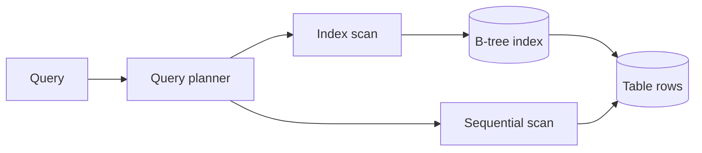

## Concept summary

An index is a data structure that helps a database find rows without scanning the whole table. Most relational databases use B-tree indexes for general-purpose lookup, range scans, and ordering.

## Key ideas

- Index columns used in selective filters and joins.
- Composite index order matters.
- Indexes speed reads but add write and storage cost.
- The query planner decides whether an index is useful.
- `EXPLAIN` is the fastest way to check assumptions.

## Architecture diagram



## SQL examples

```sql
CREATE INDEX idx_users_email ON users (email);

CREATE INDEX idx_orders_user_created
ON orders (user_id, created_at DESC);

EXPLAIN ANALYZE
SELECT *
FROM orders
WHERE user_id = 42
ORDER BY created_at DESC
LIMIT 20;
```

## Trade-off table

| Index type | Pros | Cons |
| --- | --- | --- |
| Single-column | Simple lookup | Limited for multi-filter queries |
| Composite | Supports common query shapes | Column order matters |
| Unique | Enforces correctness | Extra write checks |
| Partial | Smaller and focused | Only helps matching predicates |

## Common mistakes

- Adding indexes without checking actual queries.
- Assuming every index will be used.
- Putting low-selectivity columns first in composite indexes.
- Forgetting indexes slow inserts, updates, and deletes.
- Ignoring `ORDER BY` and `LIMIT` when designing indexes.

## Interview summary

Define indexes as read-optimized structures with write cost. Explain selectivity, composite index ordering, query plans, and why `EXPLAIN ANALYZE` beats guessing.

## Flashcards

- Q: What is selectivity? A: How well a predicate narrows rows.
- Q: Why do indexes slow writes? A: The database must update index structures too.
- Q: What does composite index order affect? A: Which filters and sorts can use the index efficiently.
- Q: What tool verifies index usage? A: `EXPLAIN` or `EXPLAIN ANALYZE`.

## Further study checklist

- [ ] Run `EXPLAIN ANALYZE` before and after adding an index.
- [ ] Practice composite index ordering.
- [ ] Learn covering indexes.
- [ ] Study partial indexes for active or non-deleted rows.
