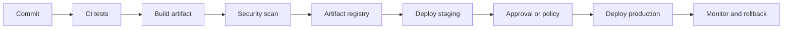

## Concept summary

CI/CD turns source changes into tested, versioned, deployable artifacts. Continuous integration validates every change. Continuous delivery or deployment moves approved artifacts through environments safely.

## Key ideas

- Run tests on every pull request.
- Build once, promote the same artifact.
- Keep secrets out of pipeline logs.
- Use automated checks before deploy.
- Make rollback simple and practiced.

## Architecture diagram



## Pipeline example

```yaml
steps:
  - name: test
    run: go test ./...
  - name: build
    run: docker build -t registry/codeatlas:$GIT_SHA .
  - name: scan
    run: trivy image registry/codeatlas:$GIT_SHA
  - name: deploy
    run: kubectl set image deploy/codeatlas app=registry/codeatlas:$GIT_SHA
```

## Trade-off table

| Choice | Pros | Cons |
| --- | --- | --- |
| Deploy every merge | Fast feedback | Needs strong tests and rollback |
| Manual approval | Human control | Slower releases |
| Build once promote | Reproducible | Requires artifact discipline |
| Rebuild per env | Flexible config | Can create drift |

## Common mistakes

- Building different artifacts for staging and production.
- Treating flaky tests as normal.
- Leaking secrets through debug logs.
- Deploying without health checks.
- Having rollback steps nobody has rehearsed.

## Interview summary

Walk through commit, test, build, scan, publish, deploy, verify, and rollback. Emphasize artifact immutability, environment promotion, quality gates, and observability after release.

## Flashcards

- Q: What is CI? A: Frequent integration validated by automated checks.
- Q: What is CD? A: Automated delivery or deployment of validated artifacts.
- Q: Why build once? A: It reduces environment drift.
- Q: What makes rollback reliable? A: Versioned artifacts and rehearsed procedures.

## Further study checklist

- [ ] Create a pipeline for a small service.
- [ ] Add unit, integration, and smoke tests.
- [ ] Learn blue-green and canary deployment patterns.
- [ ] Practice rollback from a failed deploy.
