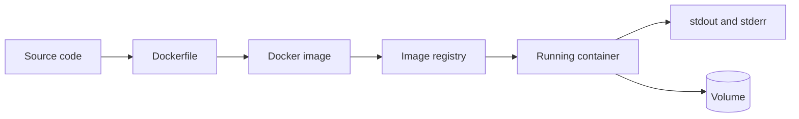

## Concept summary

Docker packages an application with its runtime dependencies into an image. Running that image creates a container: an isolated process with its own filesystem view, environment variables, and network configuration.

## Key ideas

- Images are immutable build artifacts.
- Containers are runtime instances of images.
- Dockerfiles describe repeatable builds.
- Ports expose container services to the host or network.
- Volumes persist data outside the container lifecycle.

## Architecture diagram



## Command examples

```sh
docker build -t codeatlas:local .
docker run --rm -p 8080:8080 -e PORT=8080 codeatlas:local
docker logs <container_id>
docker exec -it <container_id> sh
```

Minimal Go Dockerfile pattern:

```dockerfile
FROM golang:1.22 AS build
WORKDIR /src
COPY go.mod go.sum ./
RUN go mod download
COPY . .
RUN CGO_ENABLED=0 go build -o /out/app ./cmd/server

FROM gcr.io/distroless/static-debian12
COPY --from=build /out/app /app
ENTRYPOINT ["/app"]
```

## Trade-off table

| Choice | Pros | Cons |
| --- | --- | --- |
| Single-stage build | Easy to read | Larger image |
| Multi-stage build | Small runtime image | More Dockerfile steps |
| Alpine base | Small and familiar | Musl/glibc surprises |
| Distroless base | Smaller attack surface | Harder interactive debugging |

## Common mistakes

- Baking secrets into images.
- Running containers as root by default.
- Copying the whole repository before dependency download, hurting cache reuse.
- Treating containers as virtual machines.
- Writing logs to files instead of stdout/stderr.

## Interview summary

Explain image vs container first. Then connect Docker to repeatable builds, dependency isolation, registry distribution, and runtime configuration through env vars, ports, and volumes.

## Flashcards

- Q: What is an image? A: An immutable filesystem and metadata used to start containers.
- Q: What is a container? A: A running isolated process created from an image.
- Q: Why multi-stage builds? A: Keep build tools out of the runtime image.
- Q: Where should container logs go? A: stdout and stderr.

## Further study checklist

- [ ] Build and run a simple Go service image.
- [ ] Compare `CMD` and `ENTRYPOINT`.
- [ ] Learn `.dockerignore`.
- [ ] Scan an image for vulnerabilities.
