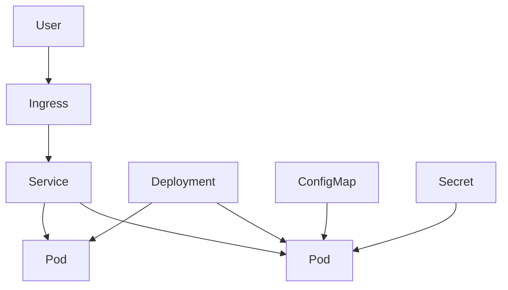

## Concept summary

Kubernetes runs containers across a cluster of machines. You declare the desired state, and controllers continuously work to make the actual state match it.

## Key ideas

- A Pod is the smallest deployable unit.
- A Deployment manages replicated Pods and rolling updates.
- A Service gives stable networking to changing Pods.
- ConfigMaps and Secrets provide configuration.
- Ingress routes external HTTP traffic into the cluster.

## Architecture diagram



## Command examples

```sh
kubectl get pods
kubectl describe deployment codeatlas
kubectl logs deploy/codeatlas
kubectl rollout status deploy/codeatlas
kubectl scale deploy/codeatlas --replicas=3
```

Minimal Deployment sketch:

```yaml
apiVersion: apps/v1
kind: Deployment
metadata:
  name: codeatlas
spec:
  replicas: 2
  selector:
    matchLabels:
      app: codeatlas
  template:
    metadata:
      labels:
        app: codeatlas
    spec:
      containers:
        - name: app
          image: codeatlas:latest
          ports:
            - containerPort: 8080
```

## Trade-off table

| Choice | Pros | Cons |
| --- | --- | --- |
| Deployment | Great for stateless services | Not enough for stable storage identity |
| StatefulSet | Stable identity | More operational care |
| ConfigMap | Easy non-secret config | Not for sensitive data |
| Secret | Better secret object | Still needs encryption and access control |

## Common mistakes

- Confusing Pod IPs with stable service addresses.
- Missing readiness probes, causing traffic to hit unready Pods.
- Storing secrets in plain manifests.
- Setting resource limits without measuring.
- Debugging only the Pod and forgetting events.

## Interview summary

Describe Kubernetes as a desired-state orchestration system. Cover Pods, Deployments, Services, ConfigMaps, Secrets, Ingress, health probes, and rolling updates.

## Flashcards

- Q: What does a Deployment manage? A: ReplicaSets and Pods for stateless workloads.
- Q: Why use a Service? A: It provides stable networking for changing Pods.
- Q: What does readiness mean? A: The Pod is ready to receive traffic.
- Q: What does liveness mean? A: The Pod should be restarted if unhealthy.

## Further study checklist

- [ ] Deploy a sample service to a local cluster.
- [ ] Add readiness and liveness probes.
- [ ] Practice reading `kubectl describe` events.
- [ ] Study rolling update and rollback behavior.
