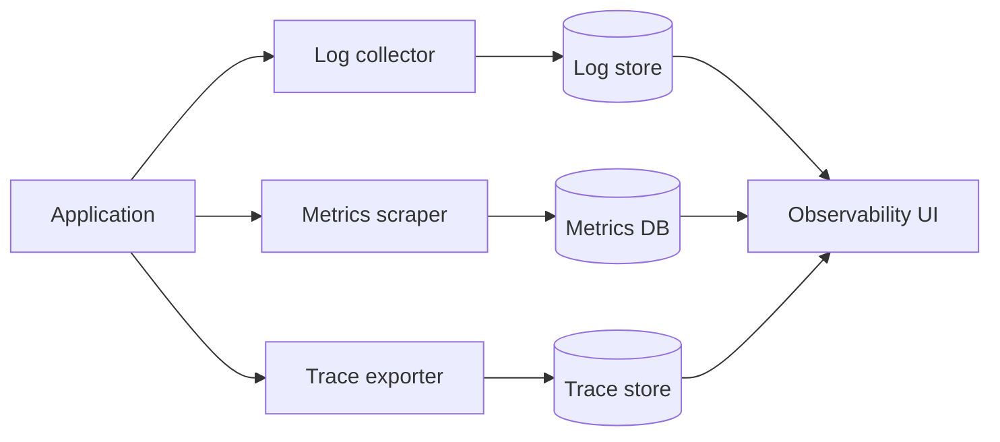

## Concept summary

Observability is the ability to understand system behavior from emitted signals. Logs explain events, metrics show trends, and traces connect work across services.

## Key ideas

- Logs are detailed event records.
- Metrics are numeric time-series for dashboards and alerts.
- Traces show a request path across components.
- Correlation IDs connect signals.
- Good instrumentation starts from user-facing outcomes.

## Architecture diagram



## Examples

Structured log:

```json
{
  "level": "error",
  "request_id": "req_123",
  "route": "/api/links",
  "error": "database timeout"
}
```

Prometheus-style metric:

```text
http_request_duration_seconds_bucket{route="/api/links",le="0.5"} 1829
```

## Trade-off table

| Signal | Best for | Watch out for |
| --- | --- | --- |
| Logs | Detailed debugging | Cost and noisy fields |
| Metrics | Alerting and trends | Too many labels |
| Traces | Distributed latency | Sampling decisions |
| Events | Business milestones | Schema governance |

## Common mistakes

- Logging sensitive data.
- Alerting on symptoms nobody owns.
- Using high-cardinality metric labels like user ID.
- Adding traces without propagating context.
- Building dashboards that do not map to user pain.

## Interview summary

Explain the three pillars through a production incident. Metrics show something is wrong, traces narrow where latency happens, and logs explain specific failures. Add correlation IDs and actionable alerts.

## Flashcards

- Q: What are metrics best at? A: Trends, SLOs, and alerts.
- Q: What are traces best at? A: Request flow across services.
- Q: What makes logs useful? A: Structure, context, and clear error fields.
- Q: What is cardinality? A: The number of unique label combinations.

## Further study checklist

- [ ] Add request IDs to a small service.
- [ ] Create RED metrics: rate, errors, duration.
- [ ] Trace a request across two services.
- [ ] Write one alert tied to a user-facing symptom.
