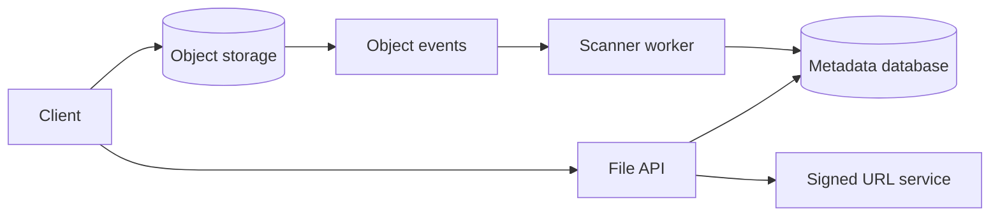

## Problem summary

A file storage service lets users upload, download, list, and share files. Most systems should store bytes in object storage and keep metadata, ownership, and permissions in a database.

## Requirements and key ideas

- Upload and download large files.
- Store file metadata, owner, size, checksum, and object key.
- Support access control and share links.
- Handle resumable or multipart uploads.
- Scan files for malware or policy violations.

## Architecture diagram



## API example

```http
POST /files/uploads
Content-Type: application/json

{
  "filename": "report.pdf",
  "content_type": "application/pdf",
  "size": 7340032
}
```

```http
HTTP/1.1 201 Created

{
  "file_id": "file_123",
  "upload_url": "https://object-store.example/upload/..."
}
```

## Trade-off table

| Choice | Pros | Cons |
| --- | --- | --- |
| Proxy uploads through API | Full control | API handles heavy bandwidth |
| Direct signed uploads | Scales better | More client complexity |
| Store files in database | Transactionally simple | Poor fit for large blobs |
| Object storage | Durable and cheap | Eventual consistency details |

## Common mistakes

- Trusting filename or content type from the client.
- Serving private files without authorization checks.
- Not validating upload completion and checksum.
- Sending large files through application servers unnecessarily.
- Forgetting lifecycle policies for deleted or expired files.

## Interview summary

Use metadata in a database and bytes in object storage. Generate signed URLs for direct upload/download, verify completion, scan asynchronously, and enforce permissions at metadata lookup time.

## Flashcards

- Q: Why signed URLs? A: They let clients transfer bytes directly to storage.
- Q: What belongs in metadata? A: Owner, object key, size, checksum, status, and permissions.
- Q: Why scan asynchronously? A: Upload latency stays low while risky files are quarantined.
- Q: What is multipart upload for? A: Large files and resumable transfers.

## Further study checklist

- [ ] Study S3-style multipart upload flows.
- [ ] Compare public, private, and expiring share links.
- [ ] Review checksum validation strategies.
- [ ] Design soft delete and retention policies.
