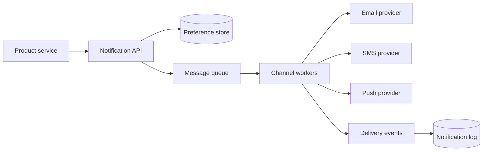

## Problem summary

A notification system sends messages through channels such as email, SMS, and push. The hard part is not the send call itself; it is honoring user preferences, retrying safely, and tracking delivery without spamming users.

## Requirements and key ideas

- Accept notification requests from product services.
- Support email, SMS, push, and in-app messages.
- Apply templates, localization, and user preferences.
- Retry transient provider failures.
- Track sent, delivered, failed, and opened events.

## Architecture diagram



## API example

```http
POST /notifications
Content-Type: application/json

{
  "user_id": "u_123",
  "template": "invoice_paid",
  "channels": ["email", "push"],
  "data": { "invoice_id": "inv_9" }
}
```

## Trade-off table

| Choice | Pros | Cons |
| --- | --- | --- |
| Sync sending | Simple request flow | User-facing latency and poor retries |
| Queue-based sending | Durable and scalable | Requires worker operations |
| One provider | Easier integration | Provider outage risk |
| Multi-provider failover | Better resilience | More routing complexity |

## Common mistakes

- Sending before checking unsubscribe and quiet-hour preferences.
- Retrying non-idempotently and sending duplicates.
- Mixing transactional and marketing notifications.
- Not recording provider response IDs.
- Treating delivery events as perfectly ordered.

## Interview summary

Separate request ingestion from delivery workers with a queue. Store preferences and templates separately. Make sends idempotent with a notification ID, retry transient failures, and record provider callbacks for delivery status.

## Flashcards

- Q: Why use a queue? A: It decouples product requests from provider latency and retries.
- Q: What makes notification retries safe? A: Idempotency keys and send logs.
- Q: What belongs in preferences? A: Channel opt-ins, quiet hours, and category-level settings.
- Q: Why track provider IDs? A: They connect callbacks to internal notifications.

## Further study checklist

- [ ] Study idempotency keys for external API calls.
- [ ] Compare queue retry and dead-letter queue patterns.
- [ ] Review email bounce and complaint handling.
- [ ] Model user notification preferences by category.
