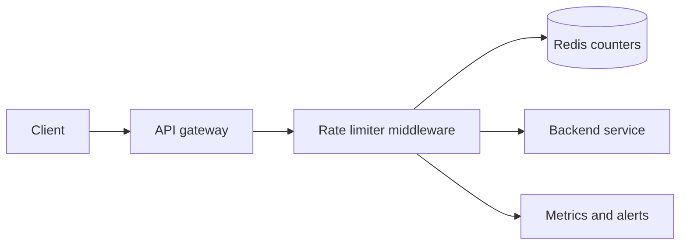

## Problem summary

A rate limiter protects services from abuse, accidental overload, and noisy clients. It answers one question quickly: should this request be allowed right now?

## Requirements and key ideas

- Limit requests by user, API key, IP, route, or tenant.
- Return useful headers such as remaining quota and reset time.
- Work across many API servers.
- Keep the decision path fast and highly available.
- Choose fail-open or fail-closed behavior intentionally.

## Architecture diagram



## API example

```http
HTTP/1.1 429 Too Many Requests
Retry-After: 17
X-RateLimit-Limit: 100
X-RateLimit-Remaining: 0
X-RateLimit-Reset: 1710000017
```

Fixed-window Redis sketch:

```text
key = "rl:user:42:minute:28500001"
count = INCR key
EXPIRE key 60
allow if count <= 100
```

## Trade-off table

| Algorithm | Pros | Cons |
| --- | --- | --- |
| Fixed window | Simple and cheap | Boundary bursts |
| Sliding window log | Accurate | Memory-heavy |
| Sliding window counter | Good balance | Approximate |
| Token bucket | Smooth bursts | More state and tuning |

## Common mistakes

- Using local in-memory counters on each server in a distributed system.
- Applying the same limit to all routes regardless of cost.
- Forgetting separate limits for login, signup, and password reset.
- Failing closed when Redis has a brief outage without considering customer impact.
- Returning `429` without `Retry-After`.

## Interview summary

Start with dimensions: who is limited, over what window, and at what granularity. Use Redis or another low-latency shared store for distributed counters. Explain algorithm choice, headers, failure mode, and observability.

## Flashcards

- Q: Why can fixed windows allow bursts? A: A client can send traffic at the end of one window and start of the next.
- Q: What does token bucket model well? A: A steady refill rate with controlled bursts.
- Q: Why centralize counters? A: Multiple servers need one view of quota.
- Q: What does fail-open mean? A: Allow requests when the limiter dependency is unavailable.

## Further study checklist

- [ ] Implement token bucket in memory.
- [ ] Study Redis Lua scripts for atomic multi-step checks.
- [ ] Compare global, tenant, and route-specific limits.
- [ ] Review rate limit response headers used by public APIs.
