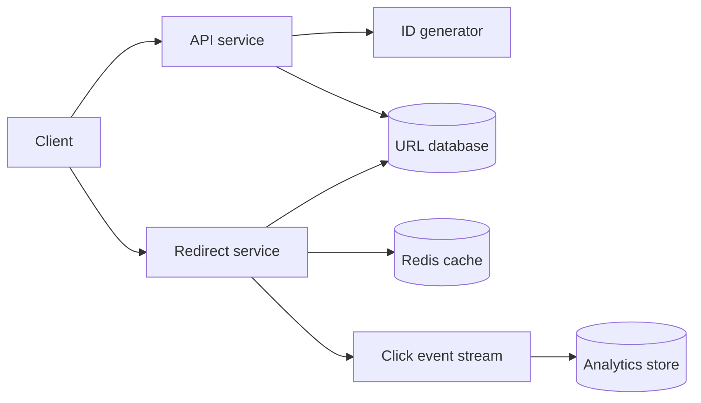

## Problem summary

A URL shortener maps a long URL to a compact code like `ca.dev/x7Kp2`. The critical path is redirect latency: users should reach the destination quickly even when a link becomes very popular.

## Requirements and key ideas

- Create a short URL for a valid long URL.
- Redirect a short code to the original URL.
- Support optional expiration and basic click analytics.
- Keep reads highly available and low latency.
- Prevent collisions when generating short codes.

## Architecture diagram



## API example

```http
POST /api/links
Content-Type: application/json

{
  "url": "https://example.com/very/long/path",
  "expires_at": "2026-12-31T00:00:00Z"
}
```

```http
HTTP/1.1 201 Created

{
  "slug": "x7Kp2a",
  "short_url": "https://codeatlas.dev/x7Kp2a"
}
```

## Trade-off table

| Choice | Pros | Cons |
| --- | --- | --- |
| Random slug | Simple, hard to guess | Must handle collisions |
| Counter plus base62 | Compact and collision-free | Predictable without extra work |
| Cache redirects | Fast hot-link reads | Cache invalidation for updates |
| Async analytics | Keeps redirects fast | Metrics are eventually consistent |

## Common mistakes

- Doing analytics writes synchronously before redirecting.
- Forgetting abuse controls for spam or malware links.
- Using a single database primary for all redirect reads.
- Not thinking about hot links that receive extreme traffic.
- Allowing custom aliases without checking reserved words.

## Interview summary

Lead with the read-heavy nature of the system. Store the mapping durably, cache hot slugs, generate collision-safe codes, and emit click events asynchronously. Mention abuse detection, expiration, and observability once the core flow is clear.

## Flashcards

- Q: What is the most latency-sensitive path? A: Short-code redirect.
- Q: Why use base62? A: It packs numeric IDs into URL-safe compact strings.
- Q: Why async analytics? A: Redirects should not wait on non-critical writes.
- Q: What causes a hot-key problem? A: One short link receives a large share of traffic.

## Further study checklist

- [ ] Practice base62 encoding and decoding.
- [ ] Compare Redis cache-aside and write-through patterns.
- [ ] Study HTTP `301` vs `302` redirect behavior.
- [ ] Think through malicious URL reporting and takedown workflows.
