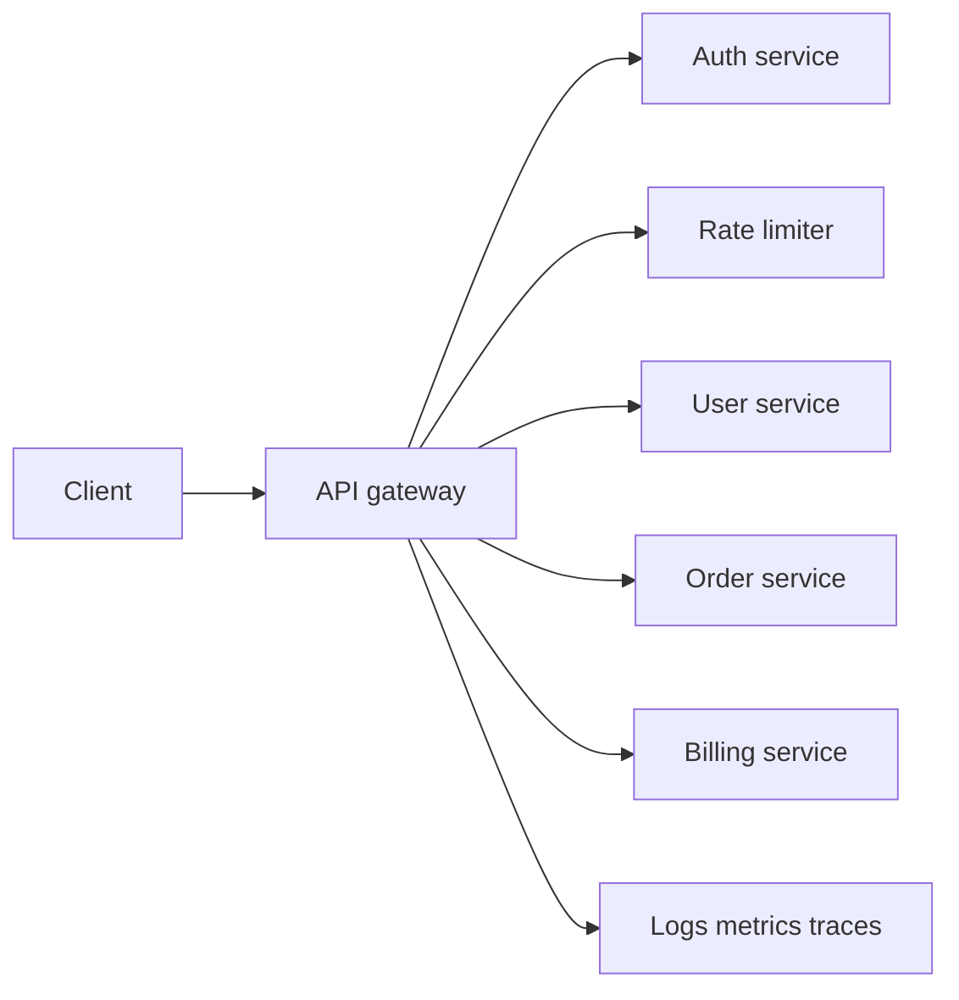

## Problem summary

An API gateway is the front door for backend services. It centralizes cross-cutting concerns such as authentication, routing, request shaping, rate limiting, observability, and sometimes protocol translation.

## Requirements and key ideas

- Route requests to the correct service.
- Authenticate users and pass identity downstream.
- Enforce rate limits and request size limits.
- Emit logs, metrics, and traces.
- Keep gateway logic generic, not full of business rules.

## Architecture diagram



## Configuration example

```yaml
routes:
  - path: /api/users/*
    service: users
    auth: required
    rate_limit: user-standard
  - path: /api/health
    service: status
    auth: none
```

## Trade-off table

| Choice | Pros | Cons |
| --- | --- | --- |
| Thin gateway | Easier to operate | Less request customization |
| Backend-for-frontend | Better client-specific APIs | More gateway logic |
| Central auth | Consistent enforcement | Gateway becomes critical path |
| Service mesh only | Strong service-to-service controls | Does not replace edge API needs |

## Common mistakes

- Putting product business logic in the gateway.
- Letting route config drift from service ownership.
- Forgetting timeouts and circuit breaking.
- Logging sensitive headers or tokens.
- Making the gateway a single regional bottleneck.

## Interview summary

Describe the gateway as an edge control plane and data plane. Cover routing, auth, limits, observability, and failure handling. Call out that services should still validate authorization for sensitive operations.

## Flashcards

- Q: What is a gateway good at? A: Cross-cutting edge concerns.
- Q: What should not live there? A: Deep domain business logic.
- Q: Why pass identity downstream? A: Services need authenticated context for authorization and audit.
- Q: What protects the gateway itself? A: rate limits, timeouts, autoscaling, and regional redundancy.

## Further study checklist

- [ ] Compare API gateway and load balancer responsibilities.
- [ ] Study JWT validation and token introspection.
- [ ] Review Envoy, Kong, and NGINX gateway patterns.
- [ ] Practice designing route config rollout safely.
